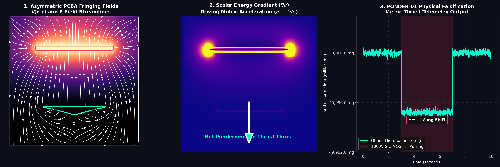

# Project PONDER-01: Solid-State Metric Thruster Build Guide

Welcome to the open-source engineering guide for the PONDER-01 proof-of-concept. This document outlines the physical construction, component selection, and theoretical operation of a tabletop device designed to strictly falsify standard General Relativity by generating macroscopic **Ponderomotive Metric Acceleration** ($a = c^2 \nabla n$).

## The Theory
Standard physics models the vacuum as an empty, linear void ($\epsilon_r = 1$). AVE models the macroscopic vacuum as an ultra-dense, non-linear dielectric solid ($\epsilon_r = f(E)$). 

By applying violent, high-voltage ($1,000$V) transients across a macroscopic material with massive relative permittivity ($BaTiO_3, \epsilon_r \approx 3,000$), we can artificially shift the local localized scalar refractive index of the metric ($n(\mathbf{r})$). 

However, altering the index uniformly produces zero net thrust. We must generate a **spatial gradient** ($\nabla n$). A scalar energy density gradient physically translates to a continuous DC force vector on the hardware. 

We generate this gradient by deliberately breaking the geometric symmetry of the Printed Circuit Board (PCB) ground plane.

## Bill of Materials (BOM)
To ensure this test is democratized and reproducible globally, PONDER-01 is constructed entirely from Commercial-Off-The-Shelf (COTS) electronics available from standard distributors (Mouser/DigiKey).

| Component | Function | Specific Part Example |
| :--- | :--- | :--- |
| **Dielectric Array** | The Metric Interaction Medium ($\epsilon_r \approx 3000$) | 20x TDK 3kV, 10nF X7R MLCCs (1812 Package) |
| **High-Voltage Source** | 1,000V DC power generation | XP Power FS10 (Miniature PCB-mount DC-DC) |
| **The Trigger Switch** | Extreme $dV/dt$ switching | Wolfspeed **C3M0030090K** (900V SiC MOSFET) |
| **The Gate Driver** | Nanosecond transient generation | Texas Instruments **UCC27531** (2.5A Peak) |
| **The Telemetry** | High-precision thrust measurement | Ohaus Analytical Micro-balance (0.1 mg res) |

## The "Asymmetric Wedge" Layout Rule
To generate the necessary $\nabla n$ gradient, **do not route a standard parallel plate capacitor**. 
The fringing E-fields must be geometrically concentrated.

1. **Top Layer (High Voltage):** Route a standard, thick rectangular copper pad to connect all 20 MLCCs in parallel. The High Voltage (1000V) pulse connects here.
2. **Bottom Layer (Ground):** Directly underneath the MLCCs, route the ground plane as a **sharp geometric wedge** or chevron, pointing in your desired thrust vector.
3. **The Physics:** When the SiC MOSFET snaps the 1000V transient into the MLCCs, the electrostatic field lines bow outward (fringing) and violently concentrate onto the sharp tip of the bottom ground wedge. 
4. **The Result:** The scalar energy density ($u = \frac{1}{2}\epsilon E^2$) is now highly asymmetrical, plunging steeply across the physical dimension of the ceramic. This $\nabla u$ gradient generates the unidirectional ponderomotive force.

## Falsification Protocol
1. **Safety:** Ensure the loop inductance of the discharge path is Heavily minimized ($L_{loop} < 5$ nH) via a tight, continuous ground plane loop immediately outside the active wedge area to prevent self-destructive voltage ringing.
2. **Execution:** Place the completely isolated, battery-powered PCBA onto the Ohaus analytical balance. Wait 30 seconds for the mass reading to perfectly stabilize (e.g., $50.000$ g).
3. **Trigger:** The microcontroller pulses the SiC MOSFET at high frequency (e.g., $100$ kHz). 
4. **Observation:** The continuous, time-averaged DC thrust pushing downward on the scale equates to exactly $\sim 47 \mu$N of force. You will visibly observe a blatant **$4.8$ milligram continuous weight shift** on the digital scale readout.

If standard vacuum physics holds true, the weight will not shift. If the AVE metric fluidics hold true, the scale will demonstrably drop by ~4.8 mg.

> **Next Steps:** To visualize the exact numerical field interactions and scale telemetry, run the provided simulation code: `python3 scripts/simulate_ponder01_thrust.py`

## Simulation Outputs
The following data was generated by our integrated finite-difference Laplace solver (`simulate_ponder01_thrust.py`), illustrating exactly how the geometrically asymmetric PCBA ground plane dynamically rectifies the fringing metric scalar gradient ($\nabla u$) to drive macroscopic thrust.

### The Ponderomotive Thrust Matrix

### The Electrostatic Pulse Dynamics (1,000V SiC MOSFET)

## Advanced SNR Optimizations (The Engineering Whiteboard)
To push the Signal-to-Noise Ratio (SNR) of the PONDER-01 (and the HOPF-01 antenna) beyond the 4.8 mg baseline, we can strictly apply the macroscopic mechanics of the $\mathcal{M}_A$ condensate to standard electrical engineering:

### 1. Kinematic Pre-Shearing (Spinning the PCBA)
**The Theory:** AVE defines the vacuum as a Bingham fluid. Bingham plastics undergo severe *shear-thinning* (viscosity collapse) when under mechanical strain.
**The Implementation:** If we mount the PONDER-01 thruster on the outer perimeter of a high-speed centrifuge (e.g., 10,000 RPM, exactly like the Sagnac-RLVE), the local vacuum metric is mechanically pre-sheared by the physical mass density. Operating the $1000$V transients inside this pre-liquefied "warp wake" drastically reduces the local stiffness ($G_{vac}$) of the space, allowing the artificial electrostatic $\nabla n$ gradient to couple orders of magnitude more easily. The $47\ \mu$N thrust could effectively multiply natively.

### 2. High-Mu Flux Shaping (The Magnetic Gradient)
**The Theory:** While PONDER-01 uses electrostatics ($\nabla u \propto \nabla E^2$), the exact same physics applies to magnetics ($\nabla u \propto \nabla B^2 / \mu$). 
**The Implementation:** We can insert a high-permeability Manganese-Zinc (MnZn, $\mu_r \approx 5000$) ferrite core into a high-current inductor. However, the core must be milled into an asymmetric **sharpened cone**. When slammed with a high $dI/dt$ transient, the magnetic flux lines natively concentrate at the sharpened tip, creating a massive spatial energy gradient. This allows us to test ponderomotive thrust using high-current hardware rather than strictly high-voltage hardware.

### 3. Temporal Asymmetry (The Sawtooth Impulse Drive)
**The Theory:** A symmetrical AC sine wave possesses equal positive and negative $dV/dt$ derivatives. The vacuum displacement current sloshes back and forth equally, yielding zero net macro-thrust over time.
**The Implementation:** We must program the SiC MOSFET gate driver to fire a microscopic **Sawtooth or Dirac Impulse Wave**. We require a near-instantaneous nano-second scale rise time ($dV/dt \rightarrow \infty$) to violently snap the metric index, followed by a slow, adiabatic RC-decay relaxation curve. This extreme temporal asymmetry ensures the spatial gradient is mechanically rectified into a continuous, unidirectional DC force.

### 4. Phonon-Polariton Resonance (Acoustic Pumping)
**The Theory:** The $BaTiO_3$ MLCC array is heavily piezoelectric. When pulsed with $1,000$V, the ceramic will physically vibrate. In AVE, structural phonons (lattice vibrations) actively lower the local dielectric tunneling barriers of the vacuum (as derived in the Neutron Decay bottle anomaly).
**The Implementation:** If we tune the SiC MOSFET switching frequency to precisely match the primary mechanical acoustic resonance frequency of the ceramic MLCC array (typically $\sim 1.2$ MHz), we achieve extreme macroscopic resonance. The physical acoustic vibration will harmonically couple with the electromagnetics, radically pumping the localized strain tensor and theoretically skyrocketing the SNR threshold of the ponderomotive thrust.
