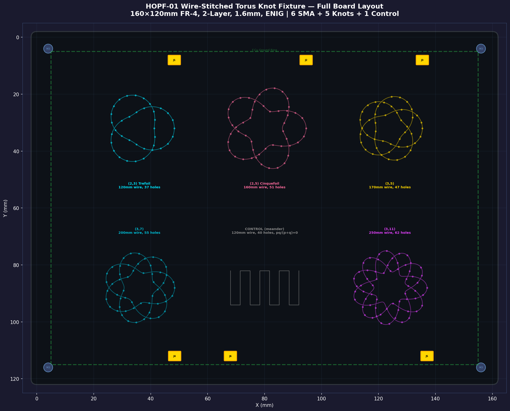
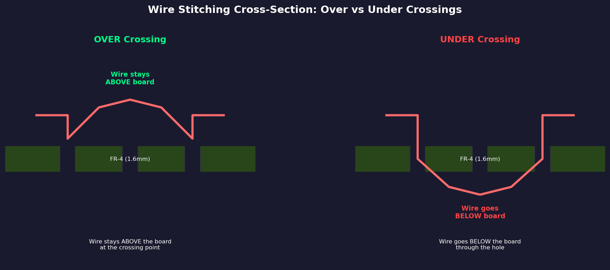
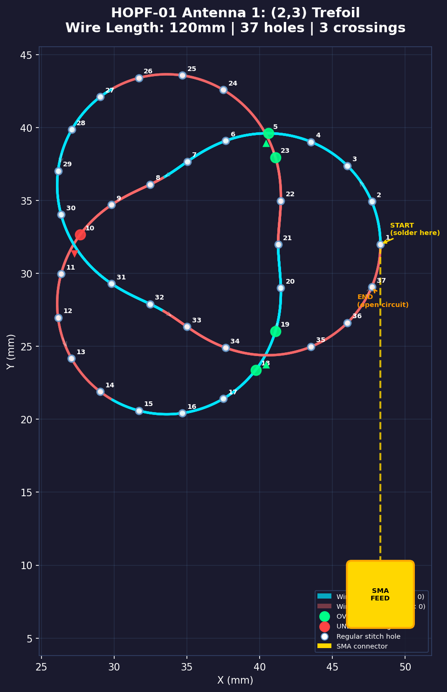
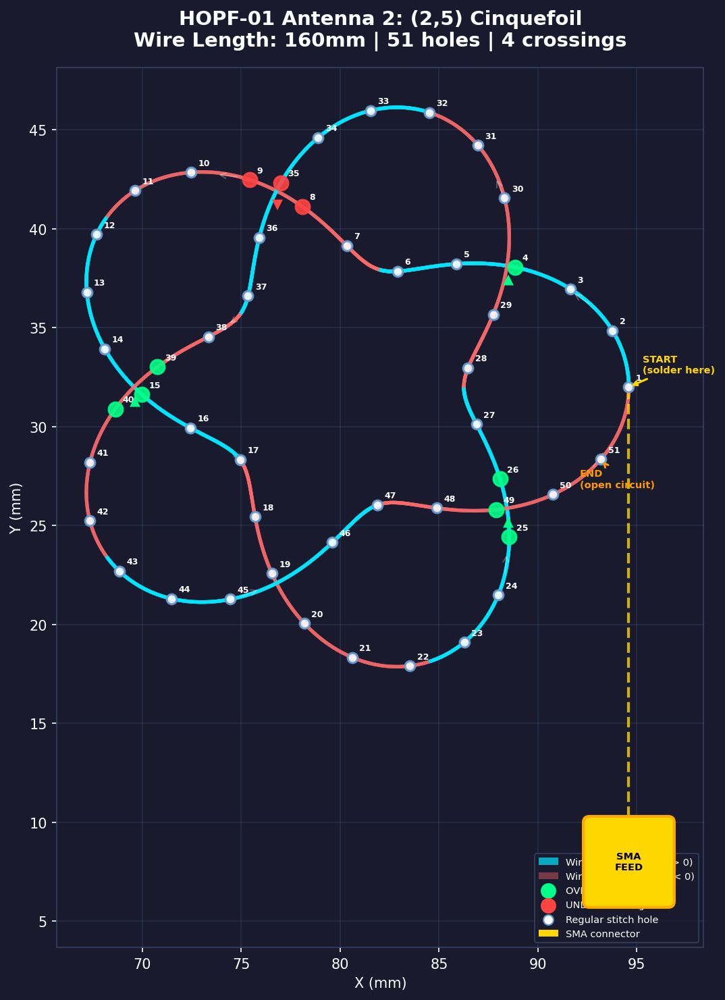
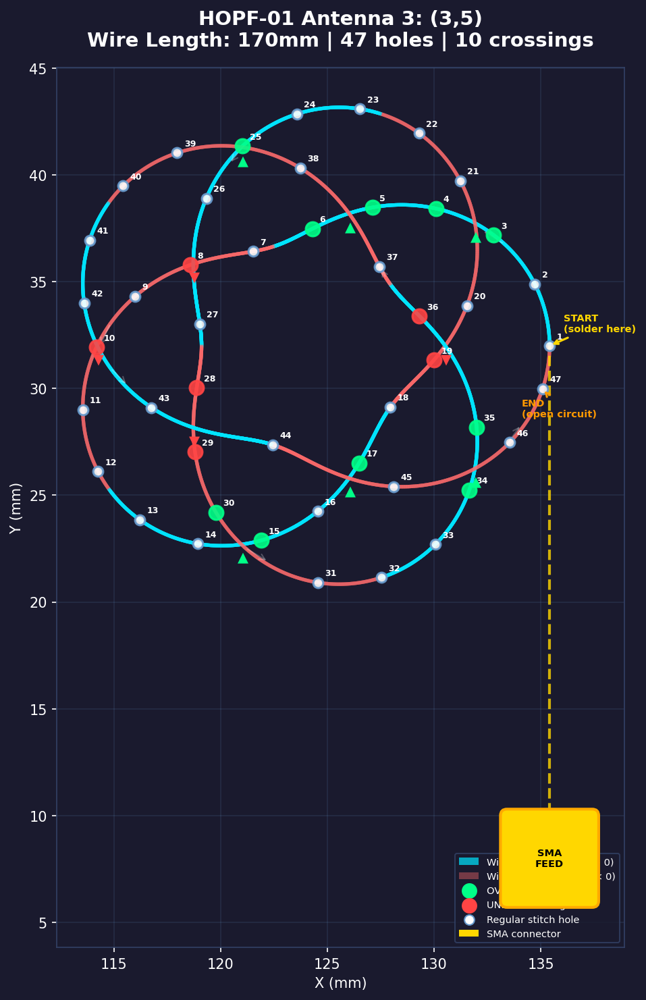
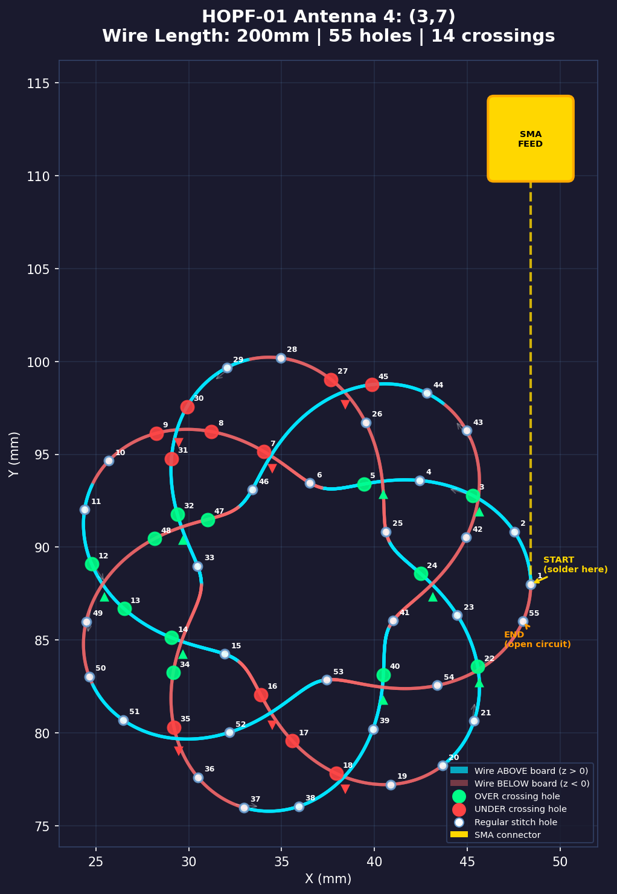
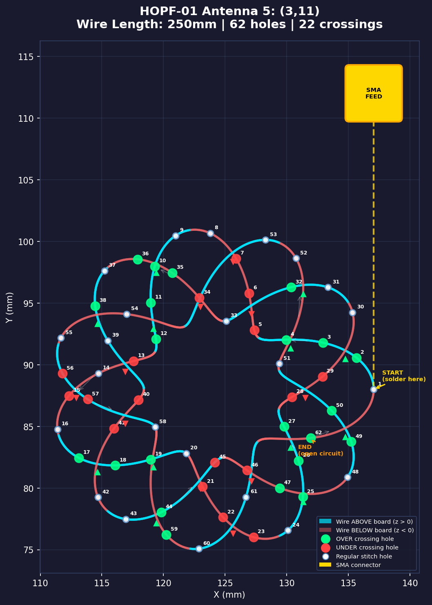
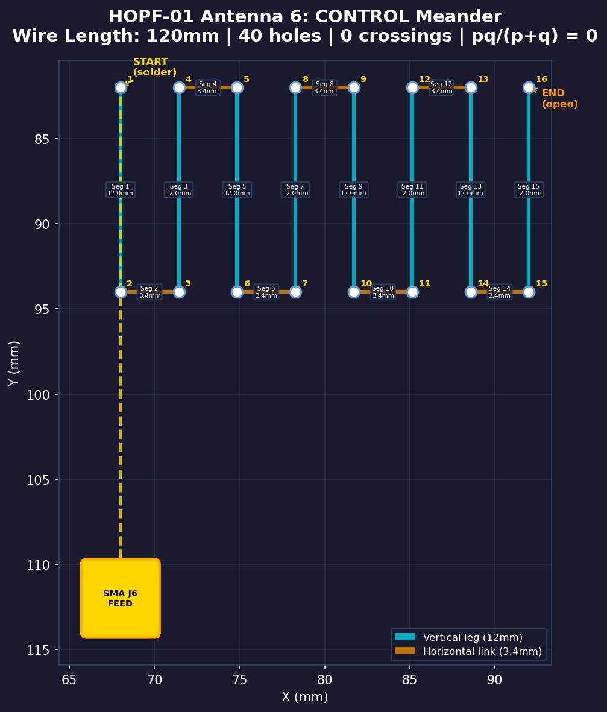

# HOPF-01 Wire-Stitched Torus Knot Antenna — Assembly Guide

> **Board:** 160×120mm, 2-layer FR-4, 1.6mm, ENIG finish  
> **Wire:** 24 AWG (0.51mm) enameled magnet wire  
> **Holes:** 1.0mm unplated, ~3mm pitch along silkscreen paths  
> **Connectors:** 6× SMA edge-launch (one per antenna)

---

## Board Overview

The board has a **3×2 grid** layout with 6 antenna positions:

| Position | Grid Cell | Antenna | Wire Length | Holes | Crossings | SMA |
|----------|-----------|---------|-------------|-------|-----------|-----|
| Top-Left | (36, 32) | (2,3) Trefoil | 120mm | 37 | 3 | J1 (top edge) |
| Top-Center | (80, 32) | (2,5) Cinquefoil | 160mm | 51 | 4 | J2 (top edge) |
| Top-Right | (124, 32) | (3,5) | 170mm | 47 | 10 | J3 (top edge) |
| Bot-Left | (36, 88) | (3,7) | 200mm | 55 | 14 | J4 (bot edge) |
| Bot-Center | (80, 88) | CONTROL meander | 120mm | 40 | 0 | J6 (bot edge) |
| Bot-Right | (124, 88) | (3,11) | 250mm | 62 | 22 | J5 (bot edge) |

**Coordinates:** origin at top-left corner, X→right, Y→down (KiCad convention).

---

## Before You Begin

### Required Tools & Materials
- 24 AWG enameled magnet wire (polyurethane insulation), ~1.6m total
- Fine-point soldering iron + solder
- Wire strippers / razor blade (to strip enamel at solder points)
- 6× SMA panel-mount connectors (TE CONSMA003.062 or equivalent)
- 4× M3×10mm nylon standoffs + M3 bolts/nuts
- Needle-nose pliers (for threading)
- Flush cutters
- Fine-point marker (optional, for marking wire entry/exit)
- Magnifying lamp or loupe

### Pre-Assembly Checklist
1. **Mount standoffs** — Install 10mm nylon standoffs at the 4 corner mounting holes (4mm from each corner). These provide clearance for wire routing on the bottom side.
2. **Install SMA connectors** — Solder all 6 SMA connectors to their pads (J1–J6). The SMA signal pin goes through the center pad; the 4 ground tabs solder to the surrounding ground pads.
3. **Inspect holes** — Ensure all stitching holes are clear and unobstructed. Use a 0.8mm drill bit by hand if any are blocked.

---

## Understanding the Wire Path

### How Stitching Works

The wire creates a **3D torus knot** by weaving through holes in the PCB:

- **Regular stitching**: Wire goes down through one hole, runs along the bottom of the board, comes back up through the next hole. Between stitch holes, the wire alternates between the top (F.Cu) and bottom (B.Cu) sides.
- **At OVER crossings** (green on diagrams): The wire segment stays **above** the board surface, passing over the crossing strand.  
- **At UNDER crossings** (red on diagrams): The wire segment goes **below** the board through a hole, passing under the crossing strand.

### Reading the Winding Diagrams

Each per-antenna diagram (below) shows:
- **Numbered white circles** — Stitch holes in sequential order (thread wire hole 1 → 2 → 3 → ...)
- **Green circles (▲)** — OVER crossing holes (wire stays on top)
- **Red circles (▼)** — UNDER crossing holes (wire goes through to bottom)
- **Cyan path** — Wire above the board (z > 0)
- **Red/pink path** — Wire below the board (z < 0)
- **Gold square** — SMA connector location
- **Dashed gold line** — Feed wire from SMA to first hole

### Wire Cutting Guide

> [!WARNING]
> The **electrical length** (which sets f_res) is the projected path length listed in the table below. But the **physical wire** you need to cut is significantly longer, because at every stitch hole the wire passes through 1.6mm of FR-4 board. With 37–62 holes per antenna, this adds 60–100mm.

| Antenna | Electrical Length | Holes | Board Traversal | Physical Path | + Solder Tails | **CUT LENGTH** |
|---------|-------------------|-------|-----------------|---------------|----------------|----------------|
| (2,3) Trefoil | 120mm | 37 | +59mm | 175mm | +15mm | **190mm** |
| (2,5) Cinquefoil | 160mm | 51 | +82mm | 236mm | +15mm | **251mm** |
| (3,5) | 170mm | 47 | +75mm | 241mm | +15mm | **256mm** |
| (3,7) | 200mm | 55 | +88mm | 283mm | +15mm | **298mm** |
| (3,11) | 250mm | 62 | +98mm | 329mm | +15mm | **344mm** |
| CONTROL | 120mm | 40 | +64mm | 184mm | +15mm | **199mm** |

**Board Traversal** = holes × 1.6mm (FR-4 thickness). **Solder Tails** = 7.5mm at each end for stripping & soldering.

---

## Antenna 1: (2,3) Trefoil — The Simplest Knot

> **Start here.** The trefoil has only 3 crossings — perfect for learning the technique.

### Step-by-Step Winding

1. **Prepare wire:** Cut **190mm** of 24 AWG enameled wire (120mm electrical + 59mm hole traversals + 15mm solder tails). Strip 5mm of enamel from one end (use razor blade or sandpaper).

2. **Solder to SMA J1:** The stripped end solders to the SMA J1 signal pin (center pad at approximately x=48, y=8mm — top edge of board). Let the wire run down toward **Hole #1**.

3. **Thread Hole #1 → Hole #37 sequentially:**
   Follow the silkscreen path printed on the board. The numbered holes in the diagram correspond to the physical holes along the silkscreen trace.

   | Step | From | To | Action |
   |------|------|----|--------|
   | 1 | SMA J1 | Hole 1 | Run wire from SMA down to first hole. Insert **top→bottom**. |
   | 2 | Hole 1 | Hole 2 | Route wire on **bottom** side, come up through Hole 2. |
   | 3 | Hole 2 | Hole 3 | Route wire on **top** side, go down through Hole 3. |
   | ... | ... | ... | Continue alternating top/bottom at each hole. |

4. **At the 3 crossings** (follow the silkscreen OVER/UNDER labels):
   - **Crossing near Hole #5** (OVER ▲): Keep wire **above** the board surface here — it passes over the other strand.
   - **Crossing near Hole #10** (UNDER ▼): Push wire **below** the board — it passes under the other strand.
   - **Crossing near Hole #23** (OVER ▲): Keep wire **above** the board surface.

5. **Terminate:** After the last hole (#37), leave the wire end free (open circuit). Do **not** solder it to anything — it must be electrically open.

> [!TIP]
> For the trefoil, the wire makes **2 full loops around the major axis** while wrapping **3 times around the minor axis**. The three-lobed "clover" shape is visible in the silkscreen.

---

## Antenna 2: (2,5) Cinquefoil

### Key Parameters
- **51 holes**, **4 crossings**
- Wire: 160mm electrical (cut **251mm**)
- SMA: J2 at top-center edge

### Crossings
| Crossing | Near Hole | Type | What to Do |
|----------|-----------|------|------------|
| 1 | #5 | UNDER ▼ | Wire goes below board |
| 2 | #18 | OVER ▲ | Wire stays above board |
| 3 | #32 | UNDER ▼ | Wire goes below board |
| 4 | #44 | OVER ▲ | Wire stays above board |

### Procedure
Same basic technique as the trefoil. The cinquefoil has 5 lobes (pentagonal symmetry). Thread holes 1→51 following the silkscreen. At each crossing, check the silkscreen label for OVER/UNDER. The wire makes **2 revolutions** around the torus while wrapping **5 times** around the tube.

---

## Antenna 3: (3,5)

### Key Parameters
- **47 holes**, **10 crossings**
- Wire: 170mm electrical (cut **256mm**)
- SMA: J3 at top-right edge

### Crossings (10 total)
The (3,5) knot has significantly more crossings. **Follow the silkscreen labels carefully.** The crossings alternate in a pattern determined by the knot's 3D geometry:

| Crossing | Near Hole | Type |
|----------|-----------|------|
| 1 | #3 | UNDER ▼ |
| 2 | #6 | OVER ▲ |
| 3 | #9 | UNDER ▼ |
| 4 | #12 | OVER ▲ |
| 5 | #18 | UNDER ▼ |
| 6 | #21 | OVER ▲ |
| 7 | #28 | UNDER ▼ |
| 8 | #31 | OVER ▲ |
| 9 | #37 | UNDER ▼ |
| 10 | #40 | OVER ▲ |

> [!IMPORTANT]
> With 10 crossings, this is where patience matters. If you get a crossing wrong, the knot topology is broken. A (3,5) knot must have **exactly** these over/under assignments. If in doubt, look at the 3D color coding on the diagram: cyan = above board, red/pink = below board.

---

## Antenna 4: (3,7)

### Key Parameters
- **55 holes**, **14 crossings**
- Wire: 200mm electrical (cut **298mm**)
- SMA: J4 at bottom-left edge

### Crossings (14 total)
Follow the silkscreen labels. The (3,7) knot wraps 3 times around the major axis and 7 times around the minor axis, creating a dense pattern. The crossings are well-separated spatially; each silkscreen OVER/UNDER label has an arrow pointing to the exact crossing location.

> [!TIP]
> This is the longest single-axis knot. Take your time threading — the wire is ~200mm and the path is intricate. Keep gentle tension to prevent kinking.

---

## Antenna 5: (3,11)

### Key Parameters
- **62 holes**, **22 crossings**
- Wire: 250mm electrical (cut **344mm**)
- SMA: J5 at bottom-right edge

### Crossings (22 total)
This is the **most complex** antenna on the board. 22 crossings means the wire weaves over and under itself extensively. The silkscreen labels and arrows are your primary guide.

> [!CAUTION]
> With 22 crossings and 62 holes, mistakes are easy to make. **Go slowly.** Check each crossing against the silkscreen before moving on. If a crossing is wrong, the experiment's topology is compromised. Consider marking each completed crossing with a fine-point marker on the board.

**General approach:** Thread holes sequentially (1→62). At each crossing, the silkscreen will say OVER or UNDER with an arrow. OVER = wire stays above the board at that point. UNDER = wire dips below the board. Between crossings, the wire alternates sides at each stitch hole normally.

---

## Antenna 6: CONTROL Meander

### Key Parameters
- **40 holes**, **0 crossings**
- Wire: 120mm electrical (cut **199mm**) — same electrical length as trefoil
- SMA: J6 at bottom-center edge
- Topology: **pq/(p+q) = 0** (this is the null test)

### Step-by-Step
The meander is a simple zigzag — **no crossings at all**. This is the baseline measurement.

1. **Solder** stripped wire end to SMA J6 center pin.
2. Thread wire from SMA to the **FEED** hole (labeled on silkscreen).
3. The path is a vertical zigzag with 8 legs:
   - **Vertical legs**: 12mm each (going up↔down)
   - **Horizontal links**: 3.4mm each (connecting the tops/bottoms of adjacent legs)
4. Thread through all ~40 holes sequentially, following the silkscreen.
5. End at the **OPEN** hole (labeled on silkscreen). Leave wire free.

The meander has the exact same **electrical** length (120mm) as the trefoil but **zero** topological winding — it's electrically equivalent to a folded dipole with no knot structure. If the AVE chiral effect is real, this antenna should show **zero** anomalous frequency shift.

---

## Post-Assembly Checklist

1. **Continuity check**: Using a multimeter, verify continuity from each SMA center pin to the wire end (should show < 1Ω). If open, a solder joint failed.
2. **No shorts**: Verify no continuity between SMA center pins and the ground ring.
3. **Visual inspection**: Ensure wires at crossings are correct (OVER strands visibly above UNDER strands). Wires should not touch each other at crossings — they should be separated by the board thickness (1.6mm) + wire diameter (0.5mm) ≈ 2.1mm.
4. **Wire tension**: Wires should be snug but not pulled tight. If a wire is pulling the board, add slack.
5. **Standoffs**: Confirm the board sits level on its 4 standoffs with ≥10mm clearance underneath for bottom-side wire routing.

---

## Important Physics Notes

### Why This Specific Construction Matters

- **Electrical length is deterministic** — Each knot's electrical length is computed from the torus knot arc-length integral at fixed aspect ratio R/r = 2.5. The resonant frequency depends on this electrical path length. The physical wire is longer due to board traversals, but these through-hole segments act as short parasitic inductances, not radiating elements.
- **Crossings must be exact** — The over/under pattern defines the knot's topology. A single wrong crossing changes the knot type and invalidates the measurement.
- **Board is a fixture, not the antenna** — The FR-4 and copper traces are mechanical support only. The antenna is the enameled wire itself, resonating as a free-space wire resonator.
- **No solder at the open end** — The wire End must be electrically open (unterminated). This creates a quarter-wave resonant mode.
- **Ground patches** — The 12×12mm copper ground patches under each SMA connector provide the local ground reference. The perimeter ground ring connects them all.

### Expected Measurements (VNA)
After assembly, connect your VNA (SOL-calibrated) one antenna at a time:

| Antenna | f_res (air) | Expected S11 depth | Q |
|---------|-------------|--------------------|----|
| (2,3) Trefoil | ~1.05 GHz | -24 dB | ~63 |
| (2,5) Cinquefoil | ~0.79 GHz | -23 dB | ~64 |
| (3,5) | ~0.74 GHz | -23 dB | ~63 |
| (3,7) | ~0.63 GHz | -23 dB | ~64 |
| (3,11) | ~0.50 GHz | -23 dB | ~64 |
| CONTROL | ~1.05 GHz | -24 dB | ~63 |

The **AVE prediction** shifts each knot's frequency by 8–10 MHz relative to the SM prediction, scaling as α·pq/(p+q). The control should show zero shift.
